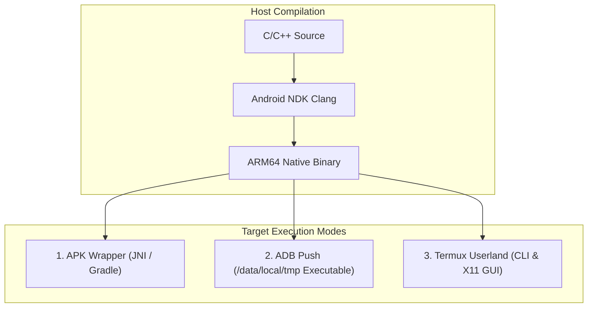

# 🤖 Android Deployment & Execution

Welcome! This hub is designed to guide you from absolute scratch to advanced deployment strategies on the Android platform. You will learn how to compile raw C/C++ source code, bundle it into APK apps, run it instantly via the developer shell (ADB), or execute full-scale command-line and graphic desktop interfaces (Termux).

---

### 🧠 Core Architecture: Android vs. Linux

If you are coming from standard Linux (GNU/Linux), Android operates differently:

| Concept | Standard Linux | Android |
| :--- | :--- | :--- |
| **C Library** | `glibc` (Feature-heavy, larger memory footprint) | `Bionic` (Optimized for low RAM, fast execution) |
| **Userland** | Standard GNU utilities (`ls`, `grep`) | Toolbox/Toybox (Stripped-down, minimal utilities) |
| **Paths** | Standard layout (`/bin`, `/usr/bin`, `/lib`) | Custom partition mapping (`/system/bin`, `/data`) |
| **Execution** | Any folder (subject to `chmod +x` permissions) | Restricted. Execution is blocked on standard user storage folders. |

```text
Host System (x86_64 Linux)                     Target Device (ARM64 Android)
+-----------------------+                      +---------------------------+
| C/C++ Source Code     |                      | Execution Environment     |
+-----------------------+                      +---------------------------+
           |                                     /          |          \
   [ NDK Clang Comp ]                           /           |           \
           |                     [ APK App ]        [ ADB Shell ]      [ Termux CLI ]
           v                           |                    |                 |
+-----------------------+              v                    v                 v
| Target Binary (ARM64) | -----> Installs to system    Pushes to tmp    Runs in Prefix
+-----------------------+
```



---

### 💻 Fast Native Compilation Example

```bash
# 1. Select the cross-compiler from your Android NDK path
export CC="/opt/android-ndk/toolchains/llvm/prebuilt/linux-x86_64/bin/aarch64-linux-android33-clang"

# 2. Compile directly into a shared native library
$CC -O3 -shared -fPIC jni_glue.c -o libnative-core.so

# 3. Stage the file directly onto your connected device
adb push libnative-core.so /data/local/tmp/
```

---

### 🗺️ Redirection Directory

*   📂 [**`native-compilation.md`**](./native-compilation.md) — Cross-compiling C/C++ source using the Android NDK for target triplets (e.g. `aarch64-linux-android`).
*   📂 [**`apk-packaging/`**](./apk-packaging/README.md) — **Execution Method 1**: Staging shared libraries (`.so`), automating builds with Gradle, alignment (`zipalign`), and APK signing (`apksigner`).
*   📂 [**`adb-target-push/`**](./adb-target-push/README.md) — **Execution Method 2**: Fast developer testing via staging executables directly in `/data/local/tmp` and executing via shell or `dalvikvm`.
*   📂 [**`termux-execution/`**](./termux-execution/README.md) — **Execution Method 3**: Running CLI binaries inside Termux and configuring Termux-X11/VNC for local GUI execution.
*   📂 [**`jni-bridge.md`**](./jni-bridge.md) — **JVM Integration**: Java Native Interface bridging, mapping primitive/object types, and native registration (`JNI_OnLoad`).
*   📂 [**`system-properties-security.md`**](./system-properties-security.md) — **Execution Constraints**: Accessing system parameters, SELinux context restrictions, ASLR memory layouts, and Control Flow Integrity (CFI).
