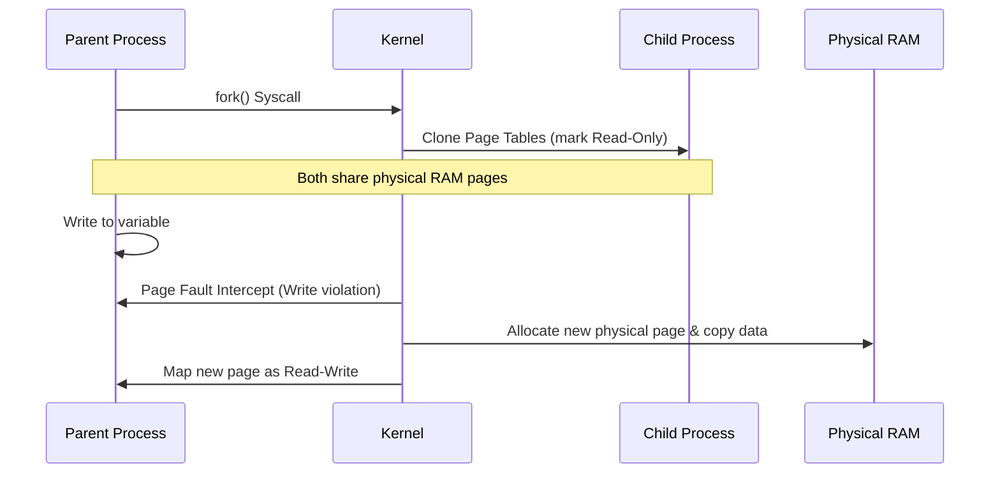

# 🔀 Fork & Exec

In UNIX systems, new processes are created by cloning the parent (`fork()`) and replacing the executable image (`execve()`).

---

### 🧠 Copy-On-Write (COW) Mechanics

To optimize performance, `fork()` does not copy physical memory pages immediately. Instead, pages are mapped as **read-only** in both processes. Physical memory allocation occurs only when a write operation occurs on a page.



---

### 💻 POSIX C Implementation

```c
#include <stdio.h>
#include <unistd.h>
#include <sys/types.h>

int main() {
    pid_t pid = fork();

    if (pid < 0) {
        perror("Fork failed");
        return 1;
    } 
    else if (pid == 0) {
        // Child execution: Replace process image with "ls" command
        char *args[] = {"/usr/bin/ls", "-lh", NULL};
        execve(args[0], args, NULL);
        
        // execve only returns on failure
        perror("Execve failed");
        return 1;
    } 
    else {
        // Parent execution continues here
        printf("Parent spawned child with PID %d\n", pid);
    }
    return 0;
}
```
