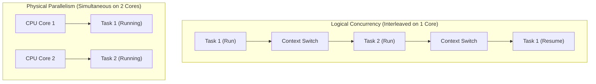

# 🔄 Concurrency

Concurrency is the **compositional structure** of a program, allowing it to handle multiple logical execution paths over overlapping time intervals.

---

### 🧠 Core Abstraction

| Attribute | Concurrency (Structure) | Parallelism (Execution) |
| :--- | :--- | :--- |
| **Core Concept** | **Handling** multiple execution sequences at the same time. | **Executing** multiple computations at the same physical instant. |
| **Silicon Mapping** | Interleaved execution on a single or multiple CPU cores via context switching. | Simultaneous execution across separate physical CPU cores, execution units, or GPUs. |
| **Primary Goal** | **Structure**: Managing non-blocking state, I/O latency, and interactivity. | **Performance**: Speeding up CPU-bound computation by dividing work. |
| **Interface** | Schedulers, event loops, state machines, fiber runtimes. | Thread pools, SIMD vector engines, GPU compute units. |



---

### 💻 Concurrency Paradigm Primitives in C

```c
// 1. Process Concurrency (Isolated Address Spaces)
pid_t pid = fork(); 
if (pid == 0) { /* Child execution loop */ }

// 2. Thread Concurrency (Shared Address Space)
pthread_t thread_id;
pthread_create(&thread_id, NULL, thread_runner, NULL);

// 3. Asynchronous Concurrency (Cooperative Non-blocking I/O)
int flags = fcntl(fd, F_GETFL, 0);
fcntl(fd, F_SETFL, flags | O_NONBLOCK); // Kernel won't block thread on read/write
```

---

### 🗺️ Redirection Directory

*   📂 [**`01-Process/`**](./01-Process/README.md) — Isolated execution spaces, copy-on-write (`COW`), and process control lifecycles.
*   📂 [**`02-Thread/`**](./02-Thread/README.md) — Shared memory execution, POSIX pthreads, and mutex/barrier synchronization.
*   📂 [**`03-Async/`**](./03-Async/README.md) — Event-driven loops, multiplexing (`epoll`), and kernel queue engines (`io_uring`).
*   📂 [**`04-Pitfalls-and-Analysis/`**](./04-Pitfalls-and-Analysis/README.md) — Mathematical safety limits (Deadlocks, Coffman Conditions, Priority Inversion).
